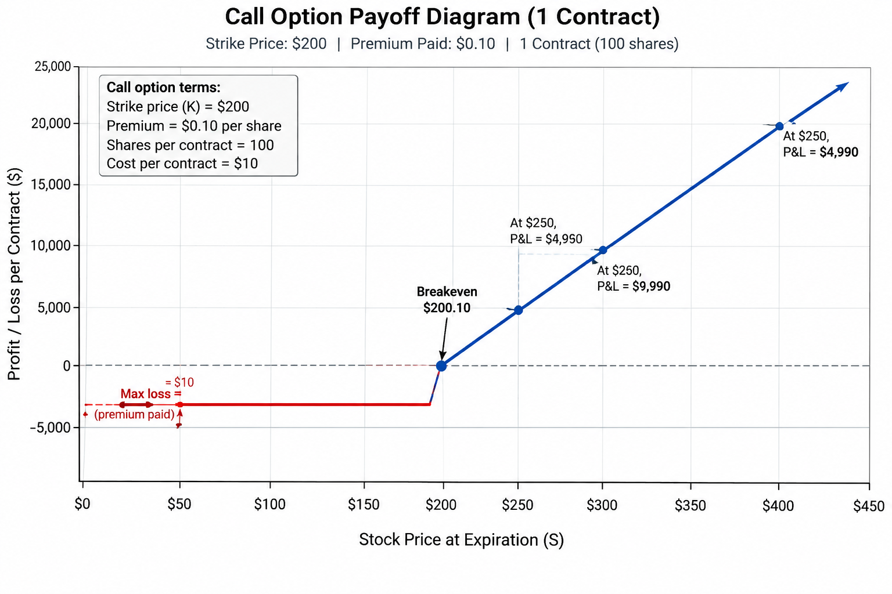

# Quiz 5

## Homer's Odessey

1. Homer works for Nuclear Company
1. Nuclear Company stock trades at $100
1. Homer has MNPI (Material Non-Public Information) about a merge
1. If and how should Homer profit?
1. Homer buys 10,000 (quanity) short-dated out of the money (OTM) call options for $0.10 at strike price of $200
1. How much money spent? $0.10 * 10,000 * 100 (contract size)
1. P&L, if price is 200 (200 - 200 - 0.10) * 10,000 * 100
1. P&L, if price is 200.1? (200.1 - 200 - 0.1) * 10,000 * 100
1. P&L, if price is 300.1? (300.1 - 200 - 0.1) * 10,000 * 100
1. What is the payoff diagram?

1. Homer goes to **jail**
